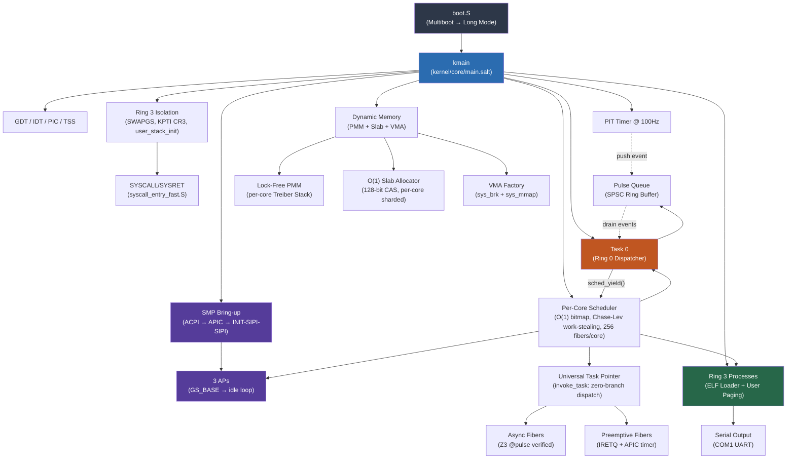

# KeuOS Kernel

**The bare-metal heart of the KeuOS operating system.** Written entirely in [Salt](../README.md), verified by Z3, running on x86_64 QEMU.

## Quick Start

```bash
# One command — builds compiler, compiles kernel, boots in QEMU
./scripts/demo_keuos.sh
```

**Prerequisites:** LLVM (`llc`, `clang`), Rust toolchain, QEMU (`qemu-system-x86_64`)

```bash
# macOS
brew install llvm qemu
# Ensure llc/clang are on PATH:
export PATH="/opt/homebrew/opt/llvm/bin:$PATH"
```

## Expected Output

```
Y12Z789!X
KEUOS BOOT: Serial OK
KEUOS BOOT: GDT...
KEUOS BOOT: IDT...
KEUOS BOOT: PIT...
KEUOS BOOT: SMP...
 SMP BRING-UP TEST SUITE
[SMP] Booting 3 Application Processors
[SMP] AP 1 ALIVE! GS_BASE loaded.
[SMP] AP 1 entering scheduler...
[SMP] AP 2 ALIVE! GS_BASE loaded.
[SMP] AP 2 entering scheduler...
[SMP] AP 3 ALIVE! GS_BASE loaded.
[SMP] AP 3 entering scheduler...
[SMP] All 3 APs online
KEUOS BOOT: CPUs online: 4
KEUOS BOOT: Scheduler...
KEUOS BOOT: PMM...
KEUOS BOOT: Slab Cache...
KEUOS BOOT: VMA...
KEUOS BOOT: Per-Core Tests...
KEUOS BOOT: Async Fiber Tests...
 ASYNC FIBER TEST SUITE
TEST:async:poll_pending_is_zero:PASS
TEST:async:spawn_slot_valid:PASS
TEST:async:step_ready_immediate:PASS
TEST:async:step_pending_count:PASS
 ASYNC FIBER TESTS COMPLETE
KEUOS BOOT: Preemptive Unification Tests...
 PREEMPTIVE UNIFICATION TEST SUITE
TEST:preempt:ipt_resolves:PASS
TEST:preempt:rip_correct:PASS
TEST:preempt:cs_correct:PASS
TEST:preempt:direct_poll_ready:PASS
TEST:preempt:task_poll_ready:PASS
TEST:preempt:fiber_executed:PASS
 PREEMPTIVE UNIFICATION TESTS COMPLETE

KEUOS KERNEL BOOT [OK]
[SMP] APs released
[KeuOS] PREEMPTIVE MODE
RING3 IRETQ FRAME TEST SUITE
TEST:ring3:iretq_frame:ALL_PASS
RING3 KPTI TEST SUITE
TEST:ring3:kpti:ALL_PASS
RING3 E2E TEST SUITE
TEST:ring3:e2e:exit_code=42
TEST:ring3:e2e:ALL_PASS
BENCHMARK SUITE BEGIN
...
BENCHMARK SUITE COMPLETE
```

The `Y12Z789!X` prefix is diagnostic output from the bootloader confirming successful 32-bit → 64-bit Long Mode transition.

## Architecture



## Component Structure

| Directory | Role | Key Invariant |
|-----------|------|---------------|
| [`core/`](./core) | Scheduler, PMM, syscalls, dispatcher, per-CPU, process mgmt, Universal Task Pointer, Ring 3 TDD (ring3_test.salt) | **Zero-Branch Dispatch:** `invoke_task(step_fn, ctx)` for all fiber types. **Chase-Lev Work-Stealing:** idle cores steal from sibling deques via full 7-field fiber migration. **Async:** Z3 `@pulse` verified. **Preemptive:** IRETQ + APIC timer. **Ring 3:** SWAPGS + KPTI CR3 (GS:[64]). |
| [`sched/`](../kernel/sched) | Chase-Lev lock-free deque, fiber affinity, work distribution | **Static Buffers:** `DEQUE_BUFFERS[16][1024]` — zero malloc dependency. **Memory Ordering:** Release/Acquire barriers for cross-core steal. |
| [`arch/`](./arch) | x86_64 boot, GDT/TSS, IDT, ISRs, SMP, SYSCALL fast path (SWAPGS), preempt_stub (user_stack_init) | **16-Core SMP:** Sequential AP handshake with GS_BASE per-CPU data. **Preemptive ABI:** `invoke_preemptive_thread` + `preempt_return_to_scheduler`. **Ring 3:** `user_stack_init` (SS=0x23, CS=0x2B). |
| [`drivers/`](./drivers) | Serial (UART), VirtIO-Net | **Isolation:** Drivers cannot corrupt kernel state |
| [`mem/`](./mem) | Slab allocator (128-bit CAS), user paging, VMA, mm_layout | **O(1):** Bump allocation, zero free cost |
| [`net/`](./net) | Ethernet, IP, UDP, ARP, **NetD bridges** (RX/TX SPSC), ARP cache (256-entry LRU), TCP connection manager (1024 TCBs), TCP parser + RFC 793 checksum, **stateless SYN cookie defense** (SipHash-2-4) | **Zero-copy:** Ring 3 data plane. Kernel is immune to packet-parsing RCE. **SYN Flood Immune:** Zero TCBs allocated during SYN_RECEIVED — cookie ISN encodes connection state. |
| [`lib/`](./lib) | SPSC ring buffer (ipc_shm), Epoch-Based Reclamation (EBR) | **Lock-free:** Single-producer single-consumer queue. **EBR:** `ebr_enter_epoch`/`exit_epoch` at kqueue dispatch level for zero-pause concurrent memory compaction. |
| [`../user/`](../user) | **Socket API** (socket.salt, socket_protocol.salt), **NetD** (netd.salt), syscall bindings | **Zero-trap data plane:** `read()`/`write()` are pure shared-memory SPSC ops. Control plane (bind/accept/close) via IPC. **SYN cookies:** `handle_syn` generates stateless ISN via SipHash-2-4; `handle_ack` validates cookie before TCB allocation. |

## Verified Kernel Primitives

Salt's Z3 theorem prover verifies memory safety contracts **at compile time**:

```salt
// PMM: Callers must provide a valid memory range
pub fn init(start: u64, end: u64)
    requires(start < end)
{ ... }

// Region allocator: Zero-byte allocations are a compile error
pub fn alloc(size: u64) -> u64
    requires(size > 0)
{ ... }
```

These contracts are checked by Z3 at every call site — if any caller could violate the precondition, the code **does not compile**.

The `@pulse` verifier extends this to async functions: every path through a state machine must reach a yield point within a cycle budget. Unbounded loops without yields are rejected at compile time.

## Performance

KeuOS targets high performance by minimizing kernel traps and relying on lock-free structures. Precise benchmarks are a work in progress.

## Build System

The kernel build uses `tools/runner_qemu.py`:

```bash
# Build only (compile all .salt + .S → kernel.elf)
python3 tools/runner_qemu.py build

# Build + boot in QEMU with benchmark
python3 tools/runner_qemu.py run
```

### Compilation Pipeline

```
kernel/**/*.salt  →  salt-front  →  MLIR  →  salt-opt  →  LLVM IR  →  llc  →  .o
kernel/**/*.S     →  clang       →  .o
                                     ↓
                              rust-lld  →  kernel.elf  →  QEMU
```

> [!IMPORTANT]
> **Zero-Panic Policy:** The kernel must never panic without diagnostic output. All panics print a status code and context message to serial before halting.
