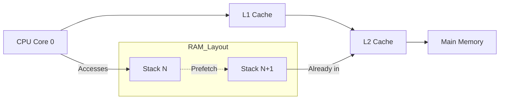

# Scheduler Policies

**The Mission:** Decide *what* runs next to maximize hardware efficiency.

## Invariants

### 1. The L1-First Affinity Strategy
We map software IDs to hardware cores to exploit the L1/L2 caches.
- **Rule:** Fibers with adjacent IDs ($N$ and $N+1$) are pinned to the same core.
- **Mechanism:** `get_affinity_core(id) -> id / 1250`
- **Why?** Stacks for $N$ and $N+1$ are adjacent in physical memory (due to `slab.salt`). Accessing Stack $N$ triggers the **Hardware Prefetcher** to pull Stack $N+1$ into the L2 Cache *before* the context switch occurs.

## Components

| File | Role |
|------|------|
| [`affinity.salt`](./affinity.salt) | **Topology Logic.** Maps Fiber IDs to Physical Cores. |

## Visualizing the Optimization

