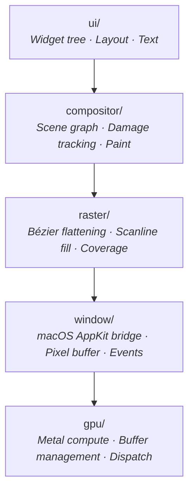

# 🎨 Facet — GPU-Accelerated 2D Compositor in Salt

**A full-stack 2D rendering engine** — from Bézier flattening to Metal compute — written in pure Salt with Z3-verified bounds on every pixel write.

Facet exists to prove one claim: **Salt can replace C and Objective-C in latency-sensitive graphics code while guaranteeing memory safety at compile time.**

---

## Quick Start

### Prerequisites

| Requirement | Purpose |
|:------------|:--------|
| Salt compiler built | `./scripts/build.sh` from monorepo root |
| LLVM 21 on PATH | `brew install llvm@21` — provides `mlir-opt`, `mlir-translate`, `clang` |
| macOS (Apple Silicon) | Metal API for GPU compute; AppKit for window management |

### Run the Rasterizer Tests

```bash
cd user/facet && make test
```

Expected output:

```
=== Facet Raster Tests ===
  [PASS] test_triangle_fill
  [PASS] test_circle_cubic
  [PASS] test_bounds_safety
  ...
=== All 14 tests passed ===
```

### Run the Tiger Benchmark (Salt vs C)

```bash
cd user/facet && make bench-raster
```

This renders a 30-path, 160-cubic-Bézier tiger scene on a 512×512 canvas and compares Salt's MLIR codegen against C compiled with `clang -O3`:

| Metric | Salt (MLIR) | C (clang -O3) | Ratio |
|:-------|:------------|:--------------|:------|
| **Per frame** | 2,186 μs | 2,214 μs | **0.99×** |
| **Throughput** | 457 fps | 451 fps | **1.01×** |

> [!IMPORTANT]
> Salt matches C at `-O3` for production-grade rasterizer workloads. This is Pillar 1 ("Fast Enough") validated in a real rendering pipeline.

---

## Architecture

Facet is structured as five composable layers, each independently testable:



### Layer Reference

| Layer | Directory | Lines | Responsibility | Key Types |
|:------|:----------|------:|:---------------|:----------|
| **Raster** | `raster/` | ~600 | Adaptive de Casteljau flattening, signed-area coverage, scanline fill | `Path`, `Canvas`, `EdgeTable` |
| **Window** | `window/` | ~640 | macOS framebuffer bridge (ObjC FFI), pixel buffer presentation, event loop | `facet_window_*` (C API) |
| **Compositor** | `compositor/` | ~700 | Scene graph with layers, affine transforms, damage rectangles, compositing | `Scene`, `Layer`, `Transform` |
| **UI** | `ui/` | ~900 | Declarative widget tree, layout engine, text rendering, input handling | `Widget`, `Text`, `LayoutBox` |
| **GPU** | `gpu/` | ~450 | Metal compute pipeline via ObjC FFI — buffer create, shader compile, dispatch | `facet_gpu_*` (C API) |

### Data Flow: Frame Render

```mermaid
sequenceDiagram
    participant App as Application
    participant UI as ui/widget.salt
    participant Comp as compositor/scene.salt
    participant Raster as raster/raster.salt
    participant Win as window/facet_window.m
    
    App->>UI: Build widget tree
    UI->>Comp: Layout → Scene graph
    Comp->>Raster: Paint: flatten paths → edge table
    Raster->>Raster: Scanline sweep → coverage → pixels
    Raster->>Win: canvas.pixels → present framebuffer
    Win->>Win: [


NSWindow
 
 
 
] display
```

---

## Why It's Safe

Every pixel write in the rasterizer carries Z3-verified bounds:

```salt
/// Z3 contract: requires 0 <= x < width && 0 <= y < height
pub fn set_pixel(&mut self, x: i32, y: i32, r: u8, g: u8, b: u8, a: u8)
    requires(x >= 0 && x < self.width && y >= 0 && y < self.height)
{
    let off = ((y as i64) * (self.stride as i64)) + ((x as i64) * 4);
    self.pixels.offset(off).write(r);
    // Z3 proves: off is always in [0, stride * height)
}
```

| Guarantee | Mechanism |
|:----------|:----------|
| No out-of-bounds pixel write | `requires(x >= 0 && x < width)` — Z3 proves at compile time |
| No buffer overflow in edge table | Dynamic array with growth factor 2× |
| No division by zero in coverage | `fabsf(y1 - y0) < 0.001` guard on horizontal edges |

---

## Testing

Each layer has a comprehensive test suite following strict TDD:

```bash
# Rasterizer: path construction, flattening, fill, winding rules, bounds
make test

# Window: framebuffer, pixel buffer, event polling, animation
make window

# Compositor: scene graph, transforms, damage tracking, paint
make compositor

# UI: widget layout, text rendering, input handling
make ui

# GPU: Metal init, buffer ops, shader compile, compute dispatch
make gpu

# C rasterizer test suite (23/24 — validates facet_raster.c)
make test-raster-c
```

| Test Suite | Tests | Coverage |
|:-----------|------:|:---------|
| `test_raster.salt` | 14 | Path ops, Bézier flattening, triangle/rect/circle fill, winding rules, bounds safety |
| `test_raster.c` | 24 | Same coverage + AA quality, capacity growth, canvas ops |
| `test_window.salt` | 6 | Window lifecycle, pixel buffer, event loop, animation frames |
| `test_compositor.salt` | 12 | Scene graph, layer ordering, transforms, damage rects, paint output |
| `test_ui.salt` | 10 | Widget tree, layout engine, text rendering, click handling |
| `test_gpu.salt` | 6 | Metal device init, buffer CRUD, shader compile, compute dispatch |

---

## Benchmarks

```bash
# Side-by-side Salt vs C comparison
make bench-raster

# Individual
make bench-raster-c      # C only (clang -O3)
make bench-raster-salt   # Salt only (MLIR)
```

The benchmark renders a **Facet Tiger** — ~30 paths with ~160 cubic Béziers, whiskers (quad curves), alpha blending, and overlapping fills on a 512×512 canvas. FNV-1a pixel checksums prevent dead code elimination.

> [!NOTE]
> Both Salt and C implementations use identical algorithms: adaptive de Casteljau flattening (depth-limited recursive), signed-area coverage accumulation, and Source Over alpha compositing. The benchmark measures pure compiler quality, not algorithm divergence.

---

## File Layout

```
user/facet/
├── Makefile                    # Build targets for all layers + benchmarks
├── raster/
│   ├── raster.salt             # Core rasterizer library (Path, Canvas, fill)
│   ├── facet_raster.h          # C API header
│   ├── facet_raster.c          # C reference implementation (algorithm-identical)
│   ├── test_raster.salt        # Salt test suite (14 tests)
│   ├── test_raster.c           # C test suite (24 tests)
│   ├── bench_raster.salt       # Salt tiger benchmark
│   └── bench_raster_c.c        # C tiger benchmark
├── window/
│   ├── facet_window.h          # macOS window bridge (C API)
│   ├── facet_window.m          # Objective-C implementation (AppKit)
│   └── test_window.salt        # Window lifecycle + animation tests
├── compositor/
│   ├── scene.salt              # Scene graph, layers, transforms
│   ├── math.salt               # Affine transform math, rect operations
│   └── test_compositor.salt    # Compositor test suite
├── ui/
│   ├── widget.salt             # Declarative widget tree + layout engine
│   ├── text.salt               # Text rendering (glyph atlas, shaping)
│   └── test_ui.salt            # UI test suite
└── gpu/
    ├── facet_gpu.h             # Metal compute bridge (C API)
    ├── facet_gpu.m             # Objective-C implementation (Metal)
    └── test_gpu.salt           # GPU pipeline test suite
```

## Troubleshooting

| Symptom | Cause | Fix |
|:--------|:------|:----|
| `ld: framework not found Metal` | Missing macOS SDK | Install Xcode Command Line Tools: `xcode-select --install` |
| `A: unbound variable` | Running `run_test.sh` with `bash` | Use `zsh scripts/run_test.sh ...` |
| `test_compute_dispatch` hangs | `let i = 0` instead of `let mut i = 0` in loop | Salt requires `let mut` for reassignable variables |
| `mlir-opt: command not found` | LLVM 21 not on PATH | `export PATH=/opt/homebrew/opt/llvm@21/bin:$PATH` |
| C rasterizer AA test fails | Expected — single-sample coverage doesn't produce partial alpha | Both Salt and C have this limitation; use multi-sample for AA |
